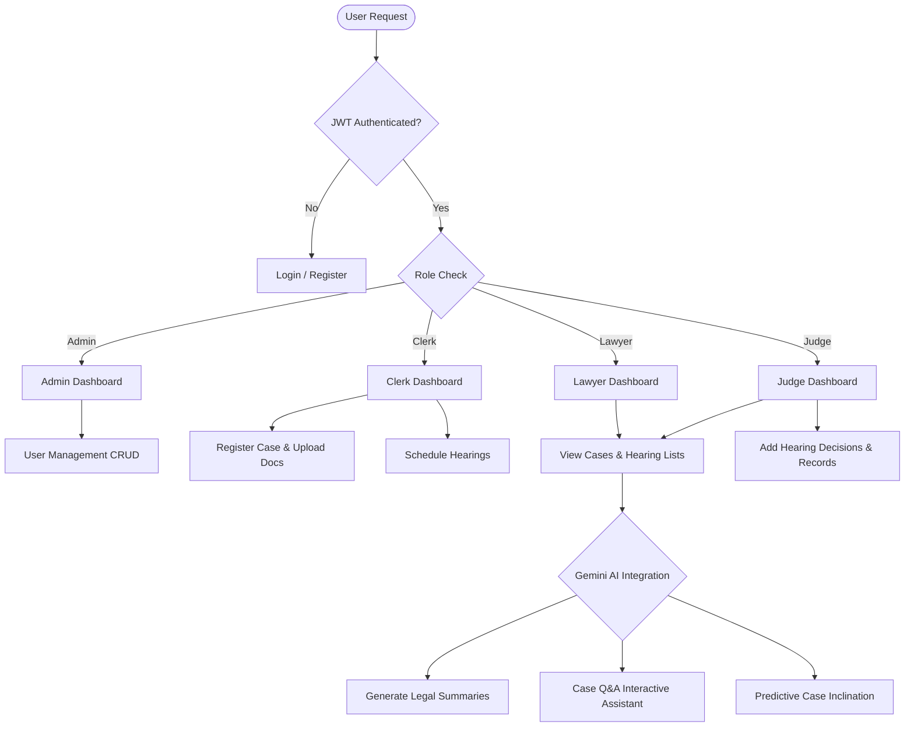
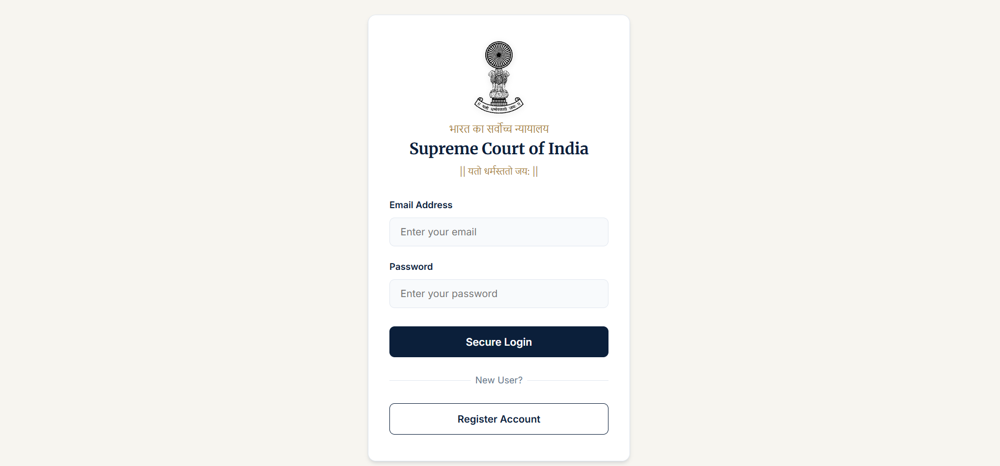
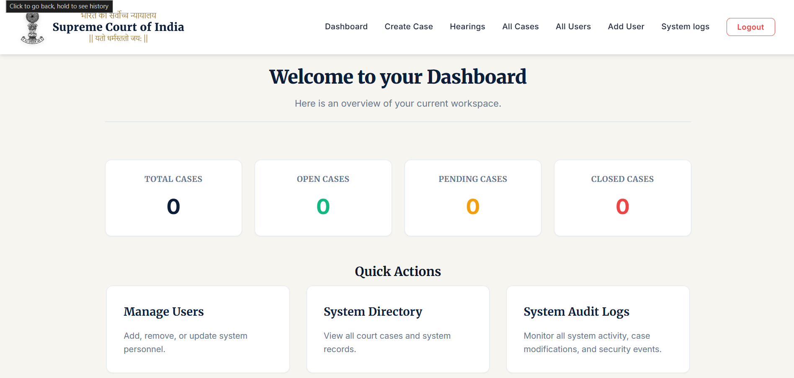

# ⚖️ Court Case Management System

[](https://nodejs.org/)
[](https://react.dev/)
[](https://www.mongodb.com/)
[](https://expressjs.com/)
[](https://vitejs.dev/)
[](https://deepmind.google/technologies/gemini/)

A premium, full-stack **Court Case Management System** built with the **MERN Stack** (MongoDB, Express.js, React, Node.js) and integrated with **Google Gemini AI** to streamline judiciary administration. The application features a design inspired by the **Supreme Court of India**, offering distinct dashboard views tailored to distinct user roles.

---

## 📌 Core Architecture & Workflows



---

## ✨ System Features

### 🔐 Security & Access Control
* **JSON Web Token (JWT)** cookie-based session authentication.
* **Role-Based Access Control (RBAC)** restricting endpoints for **Admins, Judges, Lawyers, and Clerks**.
* Secure password hashing using `bcryptjs`.

### ⚖️ Digital Case Management
* **Case Creation**: Clerks and Admins can register new cases with comprehensive metadata (Title, Status, Priority, Next Hearing Date).
* **Document Repository**: Secure file upload (PDFs, docs) per case using `Multer` middleware.
* **Hearing Records**: Track chronological hearing milestones, write judgment notes, and record official court decisions.

### 🤖 Gemini AI Legal Suite
* **Case Summarizer**: Extracts legal summaries and core highlights from case details automatically.
* **Case Chatbot**: Interactive Q&A chatbot allowing lawyers and judges to query specific facts about a case.
* **Inclination Analysis**: Evaluates case documents and logs to outline arguments and determine case leaning.

### 📅 Automations & Analytics
* **Daily Cron Jobs**: Automated email notifications sent to scheduled lawyers and judges at 8:00 AM every morning for upcoming hearings.
* **Interactive Charts**: Responsive analytics dashboards featuring case status tracking and system-wide metrics.

---

## 📸 Application Interface Showcase

### 📊 Primary Dashboards
<table width="100%">
  <tr>
    <td width="50%" align="center">
      <b>🔐 Login Interface</b><br/>
      
    </td>
    <td width="50%" align="center">
      <b>📊 Case Analytics Dashboard</b><br/>
      
    </td>
  </tr>
</table>

### ⚖️ Digital Case & Hearing Workspace
<table width="100%">
  <tr>
    <td width="33%" align="center">
      <b>📅 Today's Hearings Schedule</b><br/>
      
    </td>
    <td width="33%" align="center">
      <b>📂 Case File Repository</b><br/>
      
    </td>
    <td width="33%" align="center">
      <b>📝 Hearing Outcome Logging</b><br/>
      
    </td>
  </tr>
  <tr>
    <td width="33%" align="center">
      <b>👥 User Roles Manager</b><br/>
      
    </td>
    <td width="33%" align="center">
      <b>➕ Case Registration</b><br/>
      
    </td>
    <td width="33%" align="center">
      <b>⚖️ Smart Case Priority</b><br/>
      
    </td>
  </tr>
</table>

### 🤖 Gemini AI Legal Assist Suite
<table width="100%">
  <tr>
    <td width="50%" align="center">
      <b>💬 Legal Case Q&A Chatbot</b><br/>
      
    </td>
    <td width="50%" align="center">
      <b>⚖️ Ruling Inclination Analytics</b><br/>
      
    </td>
  </tr>
</table>

---

## ⚙️ Configuration & Environment Settings

Create a `.env` file inside the `backend/` directory.

```env
PORT=3000
MONGO_URI=mongodb://localhost:27017/court-case-management
MONGODB_URI=mongodb+srv://<username>:<password>@cluster0.mongodb.net/court-case-management?retryWrites=true&w=majority
JWT_SECRET=your_jwt_secret_key

# Email Notification Settings (SMTP)
SMTP_HOST=smtp.gmail.com
SMTP_PORT=465
SMTP_EMAIL=your_email@gmail.com
SMTP_PASSWORD=your_gmail_app_password

# Google Gemini AI Settings
GEMINI_API_KEY=your_gemini_api_key
```

> [!NOTE]
> The backend automatically detects and connects to either `MONGO_URI` or `MONGODB_URI`. If connecting to MongoDB Atlas, ensure your cluster IP whitelist permits incoming requests.

---

## 🚀 Installation & Launch

### 1️⃣ Backend Setup
```bash
# Navigate to backend directory
cd judiciary-system/backend

# Install dependencies
npm install

# Run backend development server
node index.js
```
*Backend will be active at:* `http://localhost:3000`

### 2️⃣ Frontend Setup
```bash
# Navigate to frontend directory
cd ../frontend

# Install dependencies
npm install

# Start Vite server
npm run dev
```
*Frontend will be active at:* `http://localhost:5173`

---

## 👨‍⚖️ User Roles Matrix

| Role | User Management | Case Management | Hearing Scheduling | Document Uploads | Gemini AI Assistant | System Audit Logs |
| :--- | :---: | :---: | :---: | :---: | :---: | :---: |
| **Admin** | 🟢 Full CRUD | 🟢 Full CRUD | 🟢 Full CRUD | 🟢 Upload/View | 🟢 Enabled | 🟢 Full View |
| **Clerk** | 🟡 Create Users | 🟢 Full CRUD | 🟢 Full CRUD | 🟢 Upload/View | 🟢 Enabled | ❌ No Access |
| **Judge** | ❌ No Access | 🟡 View Only | 🟡 Update Hearings | 🟢 Upload/View | 🟢 Enabled | 🟢 View Only |
| **Lawyer**| ❌ No Access | 🟡 View Only | ❌ Read Only | 🟢 Upload/View | 🟢 Enabled | ❌ No Access |

---

## 📑 API Endpoints Reference

### 🔐 Authentication (`/api/auth`)
* `POST /register` - Register a new user
* `POST /login` - Log in and assign auth token cookie
* `POST /logout` - Clear session token cookie
* `GET /check` - Verify current role permissions
* `POST /addUser` - Admin/Clerk explicit user creation route
* `DELETE /:id` - Remove a user account (Admin only)

### ⚖️ Case Management (`/api/cases`)
* `GET /` - Fetch all cases assigned/permitted for user
* `GET /:id` - Get detail report for a single case
* `POST /` - Register a new case record (Admin/Clerk)
* `PUT /:id` - Modify case details (Status, details)
* `DELETE /:id` - Remove a case (Admin only)

### 📅 Hearing Management (`/api/hearing`)
* `GET /` - List all scheduled hearings
* `GET /today` - Fetch hearings scheduled for the current date
* `GET /:caseId` - List all hearings related to a specific case
* `POST /` - Schedule a new court hearing (Admin/Clerk/Judge)

### 📂 Documents & Records (`/api/documents` & `/api/hearing-records`)
* `POST /documents/:caseId` - Upload legal files (Admin/Clerk/Lawyer/Judge)
* `GET /documents/:caseId` - Fetch all documents uploaded to a case
* `POST /hearing-records/` - Save official hearing outcome/record
* `GET /hearing-records/:caseId` - Chronological hearing record timeline

### 🤖 Gemini AI integration (`/api/ai`)
* `GET /case-summary/:caseId` - Retrieve stored case summary
* `POST /case-summary/:caseId` - Generate new summary using Gemini
* `POST /chatbot/:caseId` - Ask the AI chatbot questions about case details
* `GET /case-inclination/:caseId` - Fetch predictive ruling inclination analysis

---

## 👨‍💻 Developer & Author
Developed and maintained by **Rahul Chauhan**. 
Passionate about building modern web applications, AI integrations, and full-stack solutions.